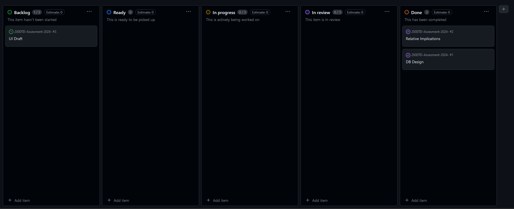
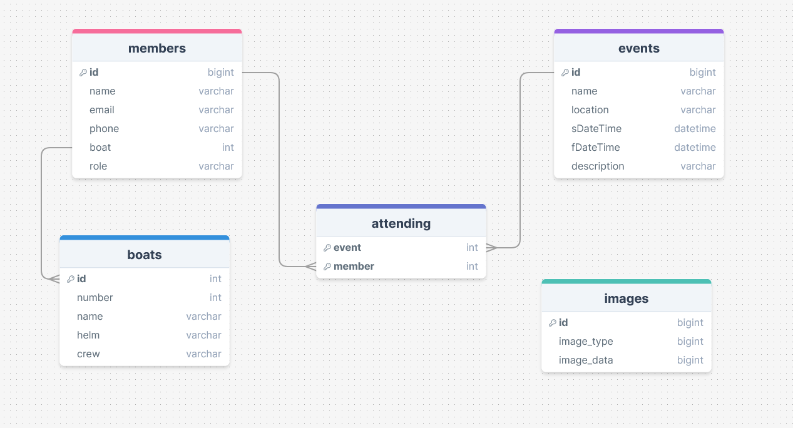
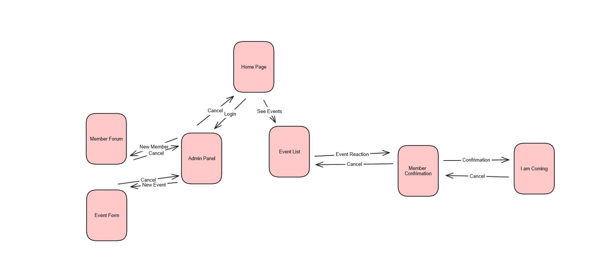
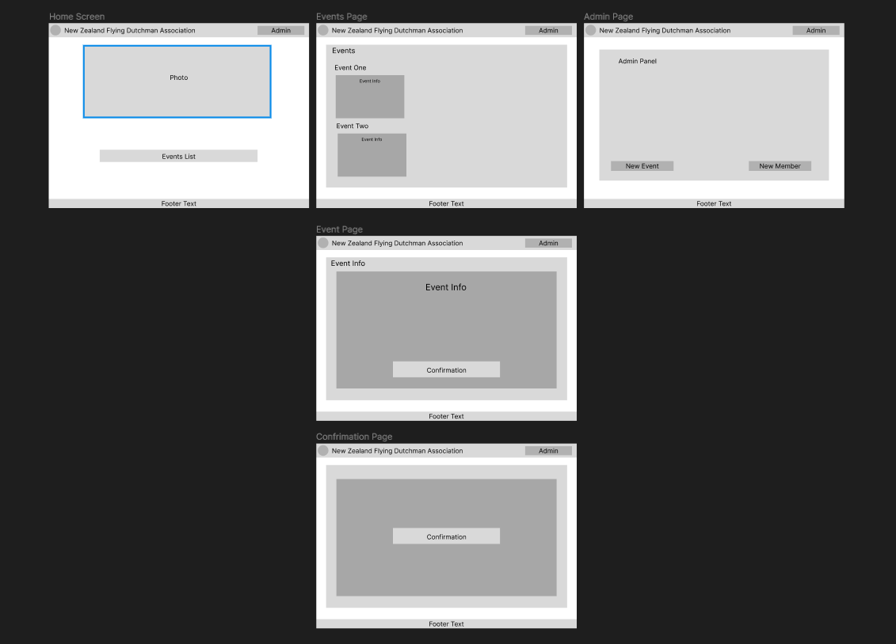

# Development of a Database-Linked Website for NCEA Level 2

Project Name: **NZFDA Association**

Project Author: **Jasper Davidson**

Assessment Standards: **91892** and **91893**

-------------------------------------------------

## Design, Development and Testing Log

#

### "Date"
#### Development: ""
##### Related Media

#

### 2024/05/16
#### Development: Github Work
Working on github board planning
##### Related Media:

#

### 2024/05/20
#### Development: DB v0.1 
First Iteration of DB
##### Related Media:

#

### 2024/05/20
#### Development: Website Flow v0.1
The flow of the website and how members and admin will flow round it.
##### Related Media

#

### 2024/05/27
#### Development: UI Design v0.1
Basic layout of the website UI and possible media/text
##### Related Media

