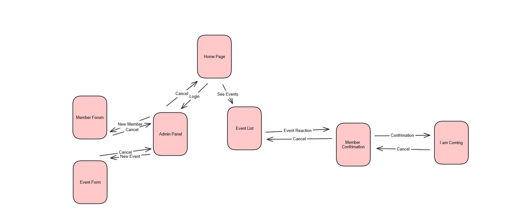
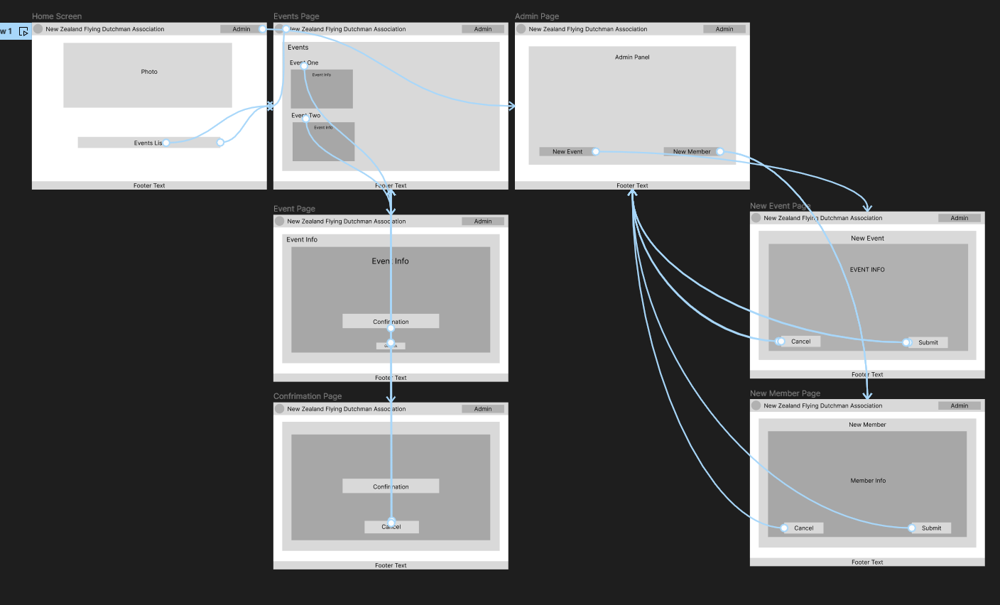

# Development of a Database-Linked Website for NCEA Level 2

Project Name: **NZFDA Association**

Project Author: **Jasper Davidson**

Assessment Standards: **91892** and **91893**

-------------------------------------------------

## Design, Development and Testing Log

#

### "Date"
#### Development: ""
##### Related Media

#

### 2024/05/16
#### Development: Github Work
Working on github board planning
##### Related Media:

#

### 2024/05/20
#### Development: DB v0.1 
First Iteration of DB
##### Related Media:

#

### 2024/05/20
#### Development: Website Flow v0.1
The flow of the website and how members and admin will flow round it.
##### Related Media

#

### 2024/05/27
#### Development: UI Design v0.1
Basic layout of the website UI and possible media/text
##### Related Media

#

### 2024/05/30
#### Development: UI Design v0.2
I have add more go back and cancel buttons, making it easier to navigate around the website for users who are on the older side and don't understand the web as well. The association does have a percentage of members who are over 70 and as not as tech savy. This was mentioned by the stakeholder when he saw the first iteration of the basic UI. He was happy with the flow diagram but wanted it more replicated in the basic ui.
##### Related Media

