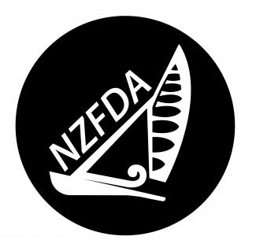

# 200DTD Assesment 2024

## Purpose
This project is a system that will allow the NZFDA to keep track of members and regatta events as well as other association business.

## Features
- Allows NZFDA to post Regatta events and get attendance.
- Allows NZFDA to add,edit or remove members and keep a record.

- Allows NZFDA Members to mark their attendance.

## Project Logo

## Documentation

The following documents support this project:

- [Design & Review](docs/Design.md)
- [Development & Testing](docs/Development.md)

PS I had fun with the comments, it was late.....
