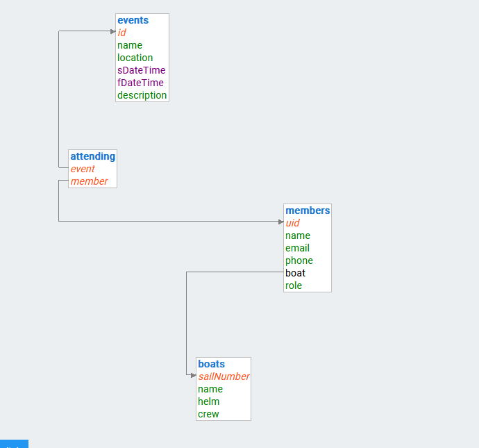
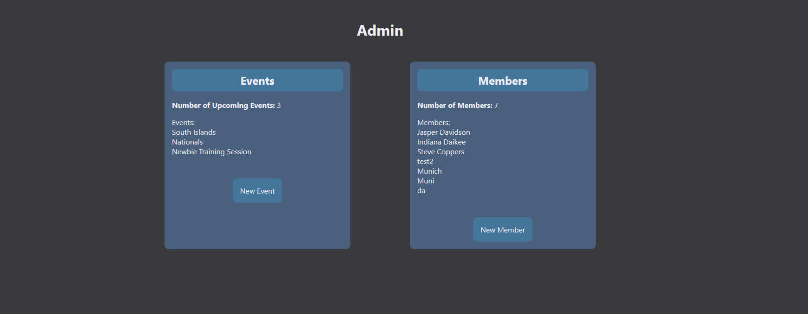
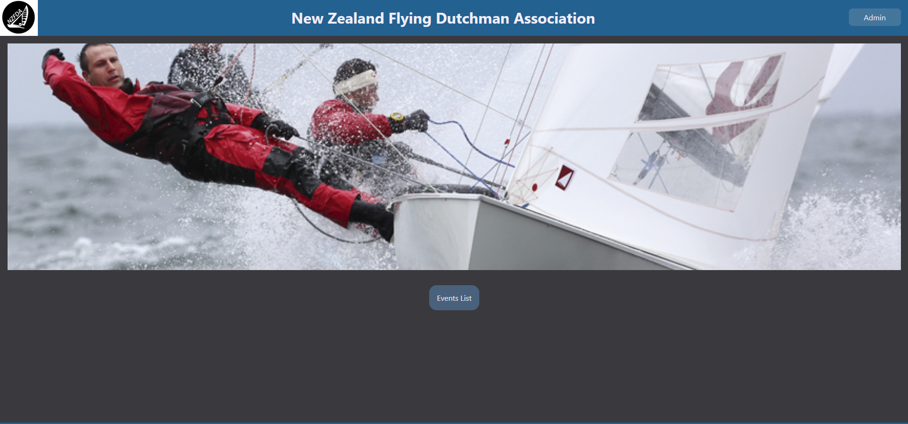
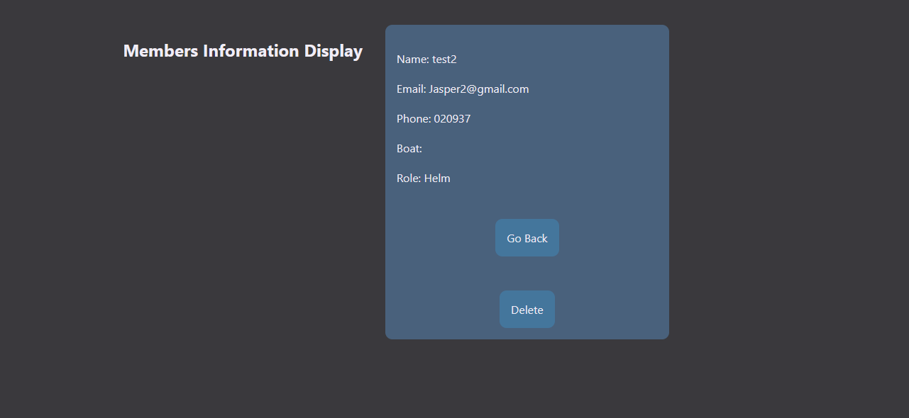
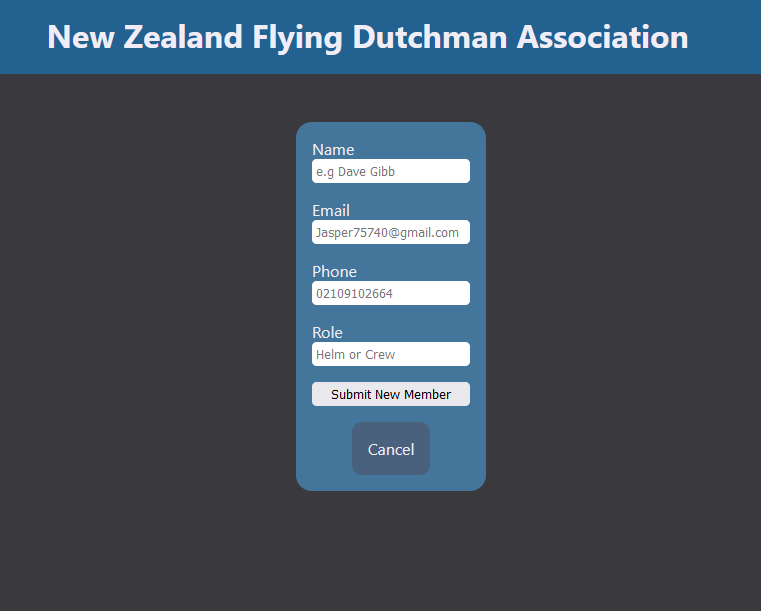
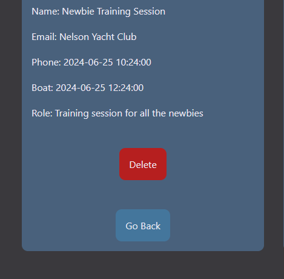
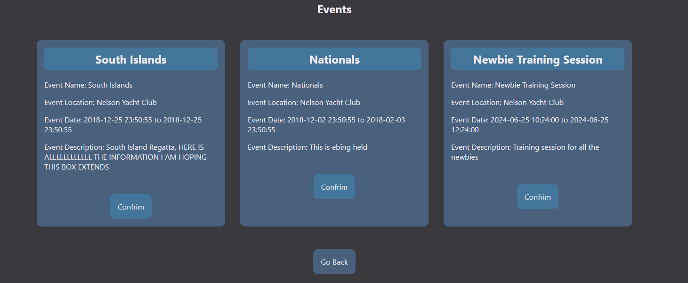
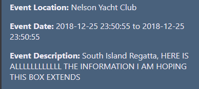
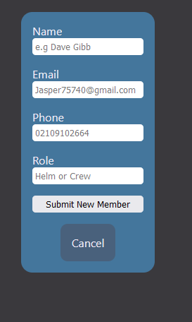
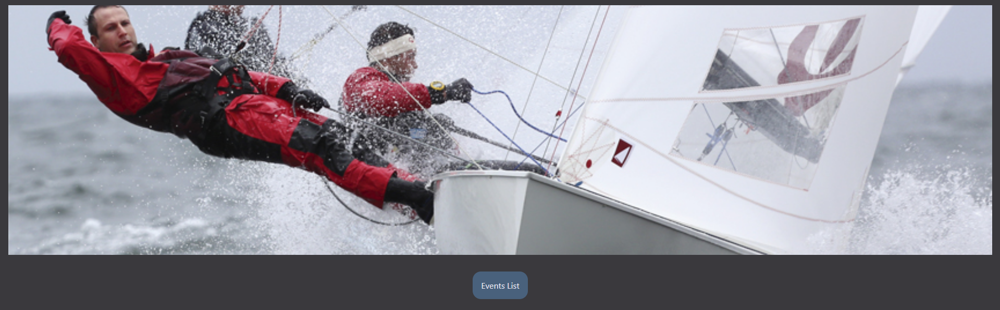

# The Design of a Database-Linked Website for NCEA Level 2

Project Name: **NZFDA Association**

Project Author: **Jasper Davidson**

Assessment Standards: **91892** and **91893**

#### Note:
>Regatta and Event term are used interchangeably throughout this project

>Public end-user group is optional and only if i have time. It is not core functionally or end user

-------------------------------------------------

## System Requirements

### Identified Need or Problem

National Secretary has no way to track Class Members, Regattas and who is attending regattas. As well as acting as a public front for the NZFDA where they can point new and prospective sailors

### End-User Requirements

#### Class Members 

* Seeing Regatta Events that are upcoming  
* Be able to say that their attending events

* Computer Competency is minimal, will need to use plain and simple design
* Plain and simple language

#### National Secretary 

* Being able to see class members 
* Who is attending Regattas 
* Being able to create Regattas

* Easy to use, will not take up massive amounts of time, as he does have a day job
* Can be done off a laptop

### Proposed Solution

#### National Secretary should be able to:

* Add Users, Remove Users, Edit Users Information (Includes Boat information)
* Add Events, Remove Events, Edit Events
* (Optional) Add Event/Boat Photos

#### Class Members should be able to:

* See and react to Events
* (Optional) Look at event photos/boat photos

#### Public (Optional)

* Find out class and association information
* Find joining information
* Look at pictures and media

-------------------------------------------------

## Relevant Implications

### Functionality

The functionality implications of a digital technology or digital outcome (e.g. a website) relate to how well it works for the end-users, in terms of meeting its intended purpose.

This implication is important for my website because there are two groups of end-users. The website will have to work for all groups and it has different functionality for all of them. So working is a key point.

Everything will be impacted by this implication. I will need to consider how I go about designing the website and making sure it is meeting it's intended purpose at the end of it. To make sure it works 100%, I will need to test regularly at every step and thoroughly.

### Usability

The usability implications of a digital technology or digital outcome (e.g. a website) relate to how easy it is to use for the end-user, without the need for help or guidance.

This implication is important because both end-user groups will need to be able to use the website easily and in the quickest way that allows them to. Everyone has busy lives, so streamlining process is key. It also has to work for the public so they can see information and media that they need but not anything else.

I will need to consider Nielsen usability heuristics, for example consistency and standards. I will need to keep my UI designs consistent and to a standard, this will make sure the end users do not get confused. Another one is user control and freedom, I will need to allow the user to cancel or go back out of everything. Because some of the end users are not great with technology, this will be key.

### Privacy

The privacy implications of a digital technology or digital outcome (e.g. a website) relate to protecting the privacy of end-users and their data.

This implication is important because I will be storing members key information like name, phone, email etc etc.

To make sure I achieve this, I will need consider data base layout and the permissions that the each end user have to provide the most secure way to storing and holding the information so only the authorized people can access this information as well as endeavour to only hold the needed information and nothing else. 

### Legal

The legal implications of storing and using media and data and making sure it conforms to all relevant NZ Law.

This is important because I will be show and storing media that is relevant to the class and association. So making sure all of it complies with relevant law is key. I am also storing members personnel data, so it has to conform to relevant NZ privacy and data Laws.

I will need to consider what media I use and where as well as how, this is will start from the beginning. Also making sure that data is collected and stored safely and I plan out how I am going to do that. Doing it wrong at the start could lead to issues later on when I have to fix it and it becomes a mess.

### End-User

This implication means making sure that the needs of the End-Users are understood and then meet within the website

This is important because I have multiple End-Users with vastly different needs, so meeting the requirements of these end-users will be key.

I will need to consider all of the mentioned implications above as the all come under this implication. Making sure I meet this implication is key because it is the most important one.

-------------------------------------------------

## Final System Design

### Database Structure

### User Interface Design

-------------------------------------------------

## Completed System

### Database Structure

### User Interface Design

-------------------------------------------------

## Review and Evaluation

### Meeting the Needs of the Users

I have strived to meet the needs of the users to my best ability. The original theme of needs were that it was clean, modern, easy to use and the navigation around the website was clear and had a strong present. To meet these universal needs I have made sure that navigation around the website is easy and efficient with the least amount of clicks possible. Keeping in line with this, it was paramount that I try and design the website in a modern way. The modern design lends its self to my end user requirements with the clean and non cluttered aesthetic. For the admin, being able to manage members and events efficiently was a must. So the whole admin panel is designed around those specifications. Overall I believe I have achieved all of those targets, however I feel like something could of been done better, for example the homepage and events panel for class members and the public. This part could be a lot more efficient and aesthetics wise its not very pleasing. To improve this I would take a bit more time playing with different layouts. If I hadn't started with such an ambitious idea then I feel this would not have been as lacking. But that's just hindsight for you.

### Meeting the System Requirements

I have implemented all the systems that are required for the national secretary needs to manage members and regattas, this has been achieved in the admin panel. He is able to add, delete and see who is attending events throughout the nation. He is able to add members and there information and delete them if needed. This also extends to boats and being able to assign a member a boat. I feel the boat adding and editing system is lacking in functionality, to improve this I would add a separate panel within the admin system specifically for boat management. For class members, they are able to see upcoming events and to confirm if they are attending the event. This is all done through the event panel.

### Review of End-User

My most important implication was End-Users, throughout this whole project I have strived to work towards the requirements of my End-Users. Whilst I have achieved this, it has not been done to the highest quality. The end user requirements were all linked together, that the website was functional and easy to navigate. I have achieved this by adding in navigation buttons as shown in the photos below. These buttons all for quick and easy navigation. I also made sure to keep UI clean and uncluttered, this means that there is less chance of something breaking or being misleading for people (shown with the events panel). I also used bolding to make it clear what was headings and to display key information. This is demonstrated in the Admin Panel with key metrics as well as the event panel.

### Review of Privacy

I addressed this outcome by making sure that I only asked for information that was critical in a sense. This means if any thing happens, very is minimal information that can be leaked or stolen. I sourced this information via a form, as shown in photo below. This form is then sent via PHP methods, by using PHP this information is hidden from anyone and sent straight to the server. 

### Review of Legal

Replace this text with brief notes showing how the implication was addressed in the final outcome. Accompany the notes with screenshots / other media to illustrate specific features.

During this process of making the website, I made sure to follow through with keeping this whole website legal. I did this by making sure any images that were used were not under copyright and that users can not upload any images that risk the legality of the website.

  