# Development of a Database-Linked Website for NCEA Level 2

Project Name: **NZFDA Association**

Project Author: **Jasper Davidson**

Assessment Standards: **91892** and **91893**

-------------------------------------------------

## Design, Development and Testing Log

#

### "Date"
#### Development: ""
##### Related Media

#

### 2024/05/16
#### Development: Github Work
Working on github board planning
##### Related Media:

#

### 2024/05/20
#### Development: DB v0.1 
First Iteration of DB
##### Related Media:

#

### 2024/05/20
#### Development: Website Flow v0.1
The flow of the website and how members and admin will flow round it.
##### Related Media

#

### 2024/05/27
#### Development: UI Design v0.1
Basic layout of the website UI and possible media/text. This was based on the initial feedback from the stakeholder.
> "We have high percentage of people who are not as tech savy, the website will need to concise and be able to always have a way out."
##### Related Media

#

### 2024/05/30
#### Development: UI Design v0.2
I have add more go back and cancel buttons, making it easier to navigate around the website for users who are on the older side and don't understand the web as well. The association does have a percentage of members who are over 70 and as not as tech savy. This was mentioned by the stakeholder when he saw the first iteration of the basic UI. He was happy with the flow diagram but wanted it more replicated in the basic ui.
>"I like the more concise navigation, being able to cancel at every stage and providing that way back. This makes it accessible to all our members."
##### Related Media

#

### 2024/05/30
#### Development: UI Design v0.3
I have generated a colour scheme, I will send this through to my stakeholder to receive some feedback which will be listed here. I choose this neutral colour scheme because its easy to see and read and the blues are linked to the ocean. Ignore the weird looking whites, these are to show that information will be put there, not related to the colours
##### Related Media

#

### 2024/6/11
#### Development: UI Design v0.4
I have updated the current basic UI design to include text and to show more of the suggested functionality of the website and how some of the information will be displayed. I will be submitting this to my stakeholder to receive feedback.
##### Related Media

#

### 2024/06/13
#### Development: UI Design v0.5
I have updated my look to be more cleaner and efficient, I did this after receiving some feedback from my pairs on how the website flowed and how the UI was designed. I am happy with this newer design and it is an improvement. I showed my previous design to my stakeholder. The feedback has been mentioned down below and this is why I asked for some advice from my pairs.
> You have everything there, but I feel as if the UI is too cluttered and your design with some of the buttons needs to fixed and you need to be more consistent with the buttons and how you color them and linking them. This is important because the association has older members who are not as tech savy. It needs to flow.
##### Related Media

#

### 2024/06/13
#### Development: New Member and Event Forum Page 
Updated the new event and member forum page to be with the new style.
##### Related Media

#

### 2024/06/24
#### Development: Event Page Created in Html/CSS 
I have created the events list page for public and club members in html and css
##### Related Media

#

### 2024/06/25
### Development: Header now allows for navigation back to home page
I have made the header a link, so people can now navigate back to the home page easily
##### Related Media

#

### 2024/06/25
### Development: UI Update
After talking to my stakeholder, we released we do not actually need the more information button as we currently display all the info in the vent box on events list page. So I have removed anything to do with this. It makes the website function better as well as flow around and not confuse any users.
##### Related Media
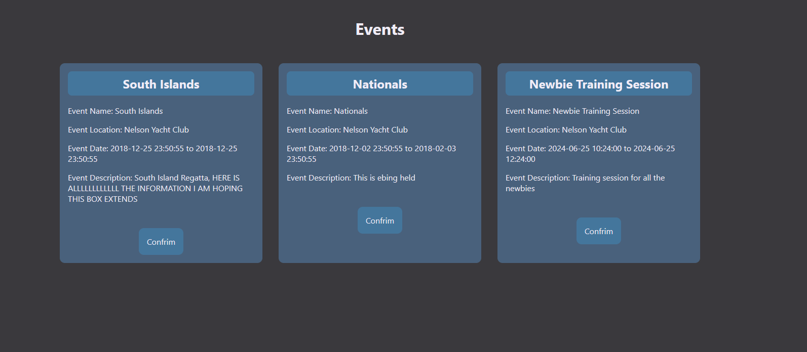

#

### 2024/06/27
#### Development: Landing page update
I have updated the header image, I will then change the layout and make it look better and move alot more efficiently.
##### Related Media

#

### 2024/06/27
#### Development: Admin Page Update
I have updated my admin page to expand and scale just like my figma mock up.
> I am liking the progress you are making so far Jasper, just make sure that you are including the navigation features so people can get around easily.

##### Related Media

#

### 2024/07/1
#### Development: New Event Forum
I have created the new event forum, this will allow for the Admin to put in new events
##### Related Media
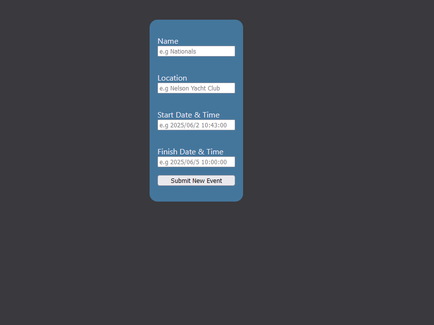

#

### 2024/07/22
#### Development: Memeber Attending Event
During the holidays I acquired some stakeholder feedback on current progress
>I like the progress you have made so far Jasper, the website has come a long way colour and design wise. However I am concerned with the lack of functionality at the moment, lots of the key features are currently missing, like attending events and adding new members as well. I would like to see some more functionality added in please.
##### Related Media
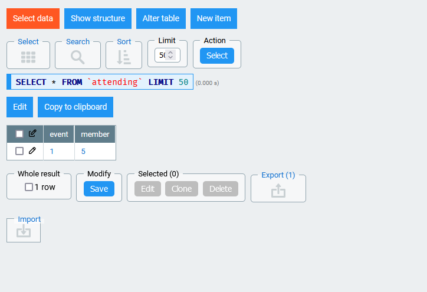

#

### 2024/08/1
#### Development: New Member and Boat Signup
I have made the new member and boat signup pages, I have also been able to setup the attending page so that the admin will be able to see who is attending. I have also updated all fourms with a cancel option so they can go back
>I am seeing some positive progress being made, however you are missing the functionality where we are able to back out of all actions easily
##### Related Media
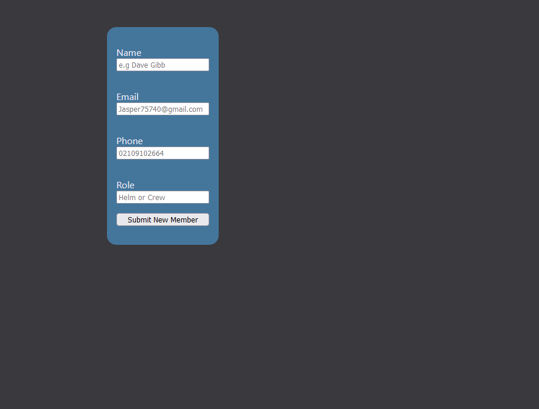
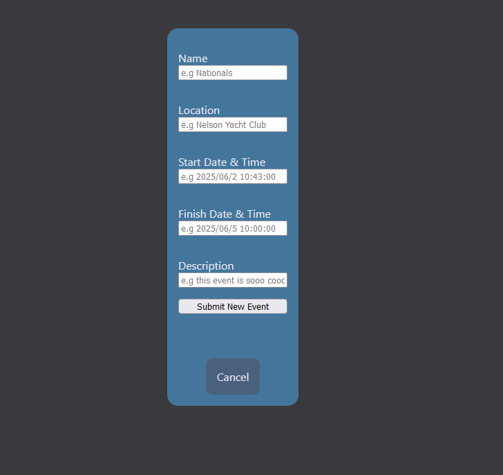

#

### 2024/08/5
#### Development: Phone Responsiveness
I have made sure that my website is mobile phone compatabile. In the start I said that it was not going to be needed. But to meet my key heuristics of functionality
and meeting end users. I have add this feature to so that it is functional on the go and people who are mobile phone savy are able to access and use this website via phones.
##### Related Media
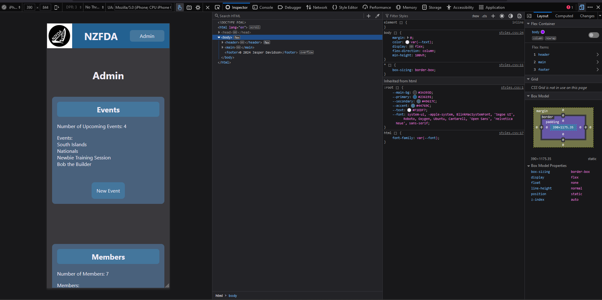

#

### 2024/08/6
#### Development: QOL and Functionality
I have updated some pages to have cancel and go back buttons for more concise navigation. I created and events and member information display page, so information concerning the events and members have a display, this is accessed by clicking on them from the admin panel. I fixed the main button on the homepage and I updated the boat picker form page to look nicer and flow better. I ran one page through a validater and I got 20 errors which are mainly br end tags. Not to hard to fix.
> I am very impressed with the progress you have made Jasper, it's leaps and bounds ahead of what it was a week ago. I like how you have made sure to update the pages with navigation aid buttons, this will help with our older generation of sailors. However I would like to see a way to see who is actually attending events and a way to delete members from the Database. I would consider this core functionality and would like to see it in the end product.
##### Related Media
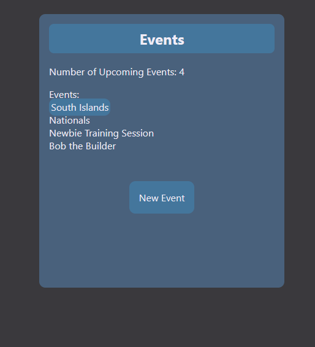
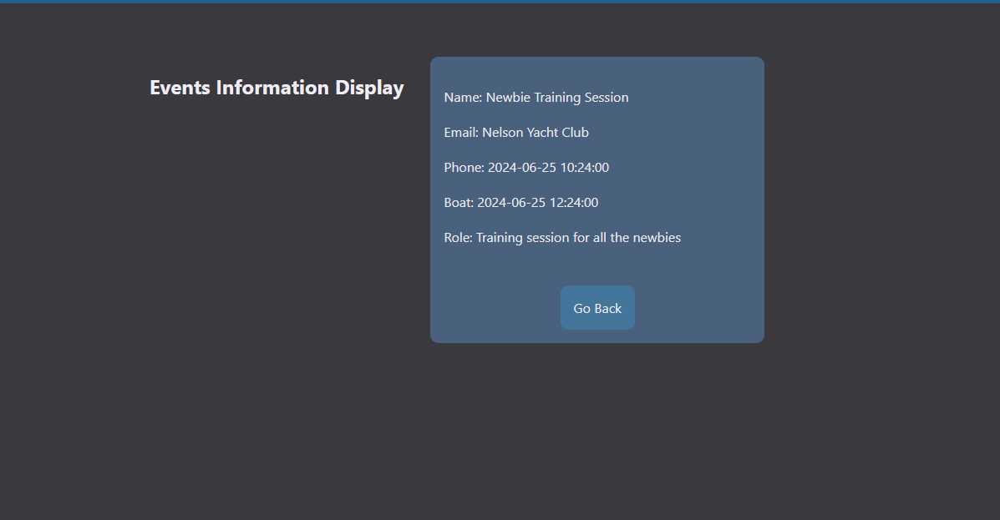

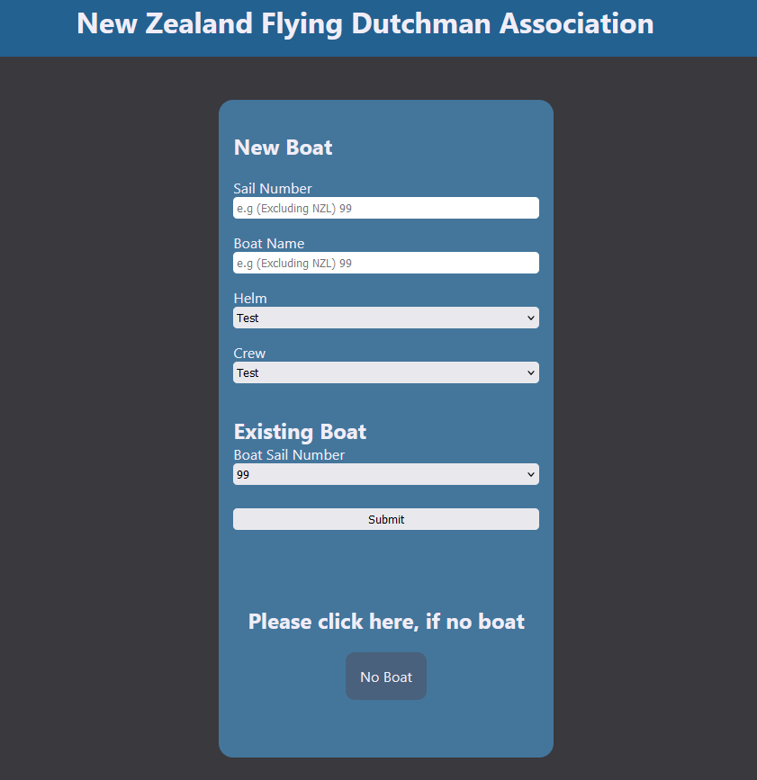
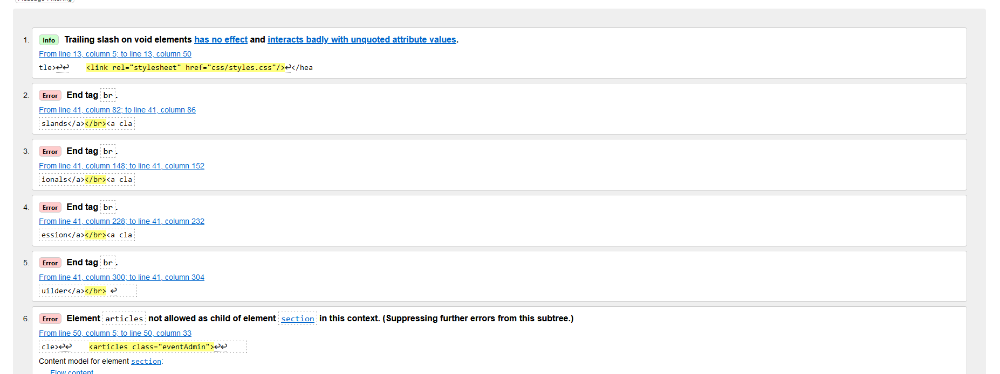

#

### 2024/08/8
#### Development: HTML Validation
All pages have been HTML Validated, I have also created the function to delete events and delete members
##### Related Media
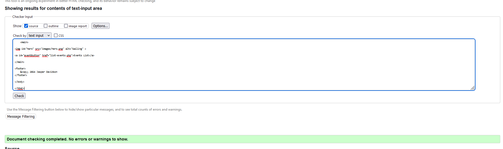

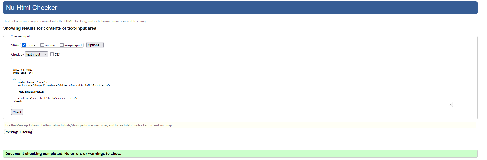

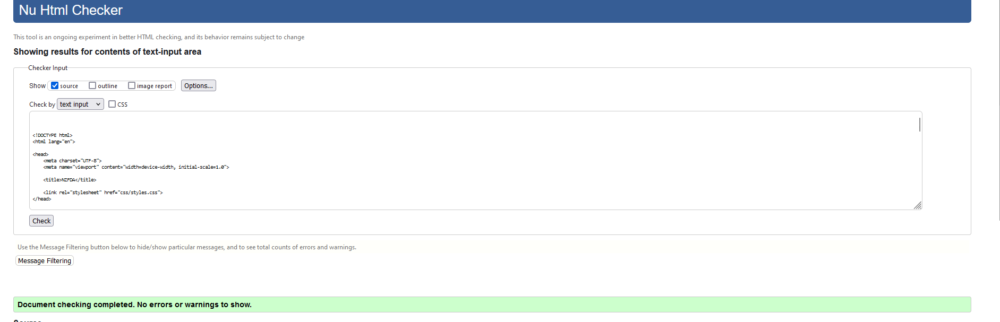

#

### 2024/08/12
#### Development: Fixing members not being able to be deleted
I had to be able to delete members, but because it was in another table I had to delete it from there first. Hence fixing my problem and ticking off another functionality part of the website. I have also bolded the two text things here as per the figma design, so people can tell that this is important and a heading.
##### Related Media
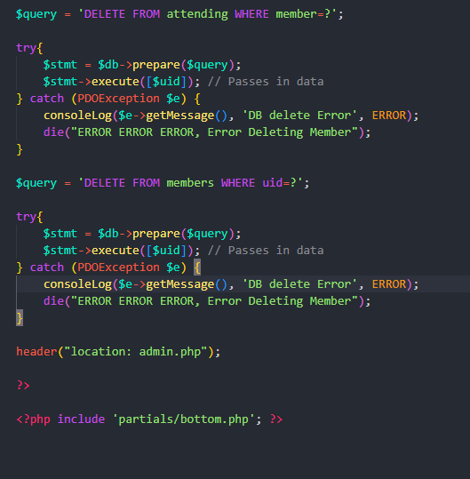
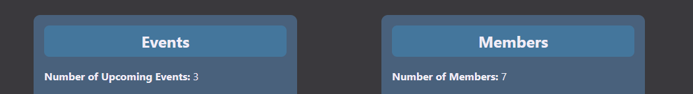