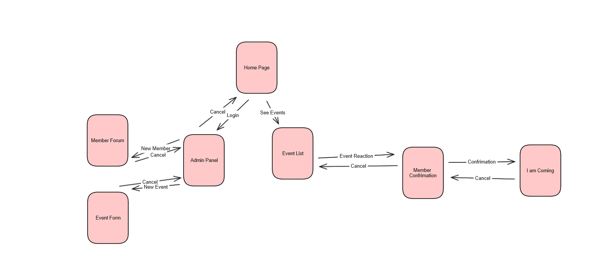

# Development of a Database-Linked Website for NCEA Level 2

Project Name: **NZFDA Association**

Project Author: **Jasper Davidson**

Assessment Standards: **91892** and **91893**

-------------------------------------------------

## Design, Development and Testing Log

#

### "Date"
#### Development: ""
##### Related Media

#

### 2024/05/16
#### Development: Github Work
Working on github board planning
##### Related Media:

#

### 2024/05/20
#### Development: DB v0.1 
First Iteration of DB
##### Related Media:

#

### 2024/05/20
#### Development: Website Flow v0.1
The flow of the website and how members and admin will flow round it.
##### Related Media

#

### 2024/05/27
#### Development: UI Design v0.1
Basic layout of the website UI and possible media/text. This was based on the initial feedback from the stakeholder.
> "We have high percentage of people who are not as tech savy, the website will need to concise and be able to always have a way out."
##### Related Media

#

### 2024/05/30
#### Development: UI Design v0.2
I have add more go back and cancel buttons, making it easier to navigate around the website for users who are on the older side and don't understand the web as well. The association does have a percentage of members who are over 70 and as not as tech savy. This was mentioned by the stakeholder when he saw the first iteration of the basic UI. He was happy with the flow diagram but wanted it more replicated in the basic ui.
>"I like the more concise navigation, being able to cancel at every stage and providing that way back. This makes it accessible to all our members."
##### Related Media

#

### 2024/05/30
#### Development: UI Design v0.3
I have generated a colour scheme, I will send this through to my stakeholder to receive some feedback which will be listed here. I choose this neutral colour scheme because its easy to see and read and the blues are linked to the ocean. Ignore the weird looking whites, these are to show that information will be put there, not related to the colours
##### Related Media

#

### 2024/6/11
#### Development: UI Design v0.4
I have updated the current basic UI design to include text and to show more of the suggested functionality of the website and how some of the information will be displayed. I will be submitting this to my stakeholder to receive feedback.
##### Related Media

#

### 2024/06/13
#### Development: UI Design v0.5
I have updated my look to be more cleaner and efficient, I did this after receiving some feedback from my pairs on how the website flowed and how the UI was designed. I am happy with this newer design and it is an improvement. I showed my previous design to my stakeholder. The feedback has been mentioned down below and this is why I asked for some advice from my pairs.
> You have everything there, but I feel as if the UI is too cluttered and your design with some of the buttons needs to fixed and you need to be more consistent with the buttons and how you color them and linking them. This is important because the association has older members who are not as tech savy. It needs to flow.
##### Related Media

#

### 2024/06/13
#### Development: New Member and Event Forum Page 
Updated the new event and member forum page to be with the new style.
##### Related Media

### 2024/06/24
#### Development: Event Page Created in Html/CSS 
I have created the events list page for public and club members in html and css
##### Related Media
